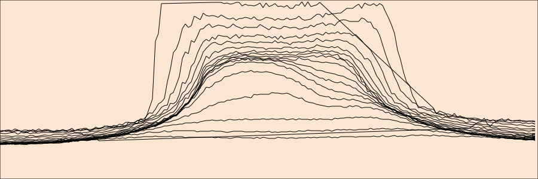
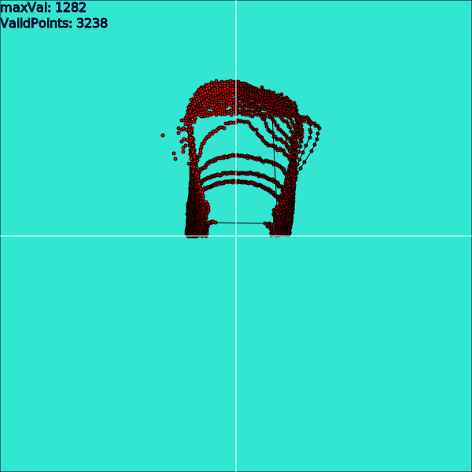

3D-Scanner
----------

Ziel dieses Projektes war es, einen 3D scanner zu bauen der Innenräume scannen kann.

Angefangen habe ich mit dem Versuch einen Ultraschallsensor auf zwei Servos zu montieren und diesen jeweils die Distanz messen zu lassen. Der Erfolg war rechtmäßig wie sich später herausstellte war das Problem, dass der Öffnungswinkel des Ultraschallsensors 45° beträgt.

Der zweite Versuch war mit einem relativ günstigen LIDAR Sensor, aber dieser hatte dann ebenfalls einen Öffnungswinkel von insgesamt 20 Grad. Dies ist immer noch zu viel um ein vernünftiges Bild zu bekommen.
Jedoch zeigte sich schon an der Software, dass das Problem prinzipiell damit zu lösen sein könnte, wenn man das Problem mit dem Öffnungswinkel löst.
Die nächste Version war dann den Garmin LIDAR Sensor mit nur noch 1 bis 2 Grad Öffnungswinkel zu nehmen und diesen über zwei kräftige Servos zu bedienen.

In der Iteration des Designs gab es verschiedene Hürden die zu meistern waren. 
Zum einen muss man aufpassen dass die Stromversorgung für die Servos kräftig genug ist. 
Leider hatte ich hier 4 mal hintereinaner zu schwache USB-Netzteile un Powerbanks.
Am besten verwendet man hier eine getrennte Stromversorgung. 
Denn sonst beeinflussen die Spikes beim Anlaufen der Servos sowohl die Sensorsignale als auch wenn es 
dumm läuft die Servo Signale selber. Deswegen habe ich eine eigene 5 Volt Versorgung für die Stromversorgung der Servus verwendet. 
Mit dem einfachen VL53L0X Sensor lässt sich noch die Servosteuerung auf dem ESP8266 direkt verwenden. 
Wenn man allerdings den Garmin Sensor verwenden will, dann sollte man die Servo Ansteuerung 
nicht auf dem gleichen Wemos Board machen sonst beeinflussen sich die beiden und der Sensor liefert immer NACK, da er Probleme mit der I2C Kommunikationn hat.
Um die Servosteuerung zu trennen habe ich das PCA9685 Board verwendet (ein 16 Kanal I2C PWM converter).
Dieser steuert jetzt die beiden Servos an und hat auch eine eigene Stromversorgung für die Servos bekommen.
Damit funktioniert das Ganze recht zuverlässig.

Die beiden LIDAR Sensoren sind beide über I2C anschliessbar. Sowohl der Garmin Sensor als auch der günstige
VL53L0X Sensor. Damit ist die I2C Schnittstelle (Pin D1,D2) des Wemos Chip schon belegt. 
Um auf die SD-Karte zu schreiben braucht man die SPI Schnittstelle damit sind die Pins der SPI Schnittstelle (D5,D6,D7,D8) auch belegt.
Somit bleiben nur noch der PIN D0,D3 und D4 übrig um einen Servo an zu steuern. 
Das ist ein weiterer Grund warum es sich rentiert den I2C converter zu verwenden.
Denn dadurch sind nach außen wirklich nur 4 Kabel an die Sensoreinheit notwendig.

![scan-3D.scad](img/scan-3D.scad

Weitere Links
-------------

https://static.garmin.com/pumac/LIDAR_Lite_v3_Operation_Manual_and_Technical_Specifications.pdf

Andere ähnliche Projekte:
-------------------------

3D-Printable Parts are taken from https://github.com/bitluni/3DScannerESP8266

