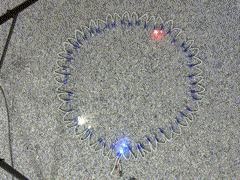

Uhr mit einem Neopixel Ring
===========================

Mittels eines Neopixel Rings wird die aktuelle Uhrzeit angezeigt.

 - Im setup wird mit dem Wifimanager eine Verbindung zum lokalen WiFi hergestellt.
 - Der Wemos-D1-Mini synchronisiert dann die Uhrzeit mittels NTP (Network Time Protokoll)
 - Es wird dann die Uhrzeit in Hour,Minute,Second,usec zerlegt. Diese werden dann auf die 24 LEDs im Neopixel Ring umgerechnet.
 - Zuerst werden alle Pixel auf die Hintergrundfarbe gesetzt.
 - Danach werden die passenden Pixel in den passenden Farben für die Stunde,Minute und Sekunde gesetzt.
 - Durch einfaches umrechnen der Sekunden in die Pielposition würden bei großen Neopixel Ringen Sprünge in der angezeigten LED entstehen.
   Erster Schritt um dies zu verbessern ist es in die Berechnung der LED die Sekunden von ganzzahligen Werten auf double Werte anzupassen. 
   Damit kann man dann die ausgelassenen LEDs verhindern. Jetzt hat man immer noch einen harten Übergang zwischen den LEDs.
   Um hier die Benutzererfahrung zu verbessern werden immer zwei aufeinander folgende LEDs entsprechen als fading Übergang gedimmt. 
   Damit entsteht der Eindruck, daß die LEDs sich ineinander fliessend bewegen. Das ist im Video an den blauen LEDs (Minutenzeiger) zu sehen. 
  
Zeitraffer Aufnahme

