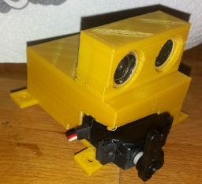

Hand Wash Timer Build with a Servo
==================================

If you get closer to the sonar distance sensor a timer starts 
and counts down from 20seconds to zero.

Displaing the timer is done with a standard Servo

There are different source Codes available.

 - The [minimal Version](src/Wemos-D1-HandwashTimerServo-Minimal) is stripped of to almost the minimum. This way you can see that not really much is needed to get it working.
 - The [Version with Delay](src/Wemos-D1-HandwashTimerServo). This Variant is using a delay() command to timer the 20 seconds.

First Try for a [housing](3D-Thing/)
   printing takes about 3h
   Material Cost about 1.46€

Used Hardware:
--------------
   the cost for the electronic parts is about 7€ 
   based on bying 10 sets

* D1 mini - Mini NodeMcu 4M bytes Lua WIFI Internet of Things development board based ESP8266 WeMos
   - https://www.aliexpress.com/item/32651256441.html
   - price: 2.216€

* HC-SR04 to world Ultrasonic Wave Detector Ranging Module for arduino Distance Sensor
   - https://www.aliexpress.com/item/32786749709.html
   - price: 0.782€ 
   
* Micro Servo Motor For Robot or RC Airplane SG90 9G
   - https://www.aliexpress.com/item/4000093416296.html   
   - price: 1.090€
   
* Mini Breadboard kit for Arduino
   - https://www.aliexpress.com/item/32564367417.htm
   - price: 0.270€
 
* Dupont Line (small connection Wired)
   - https://www.aliexpress.com/item/32956301840.html
   - price for 40pins: 1.52€
   - you Need 
     - one set Male - Male
     - one set Male - Female
     